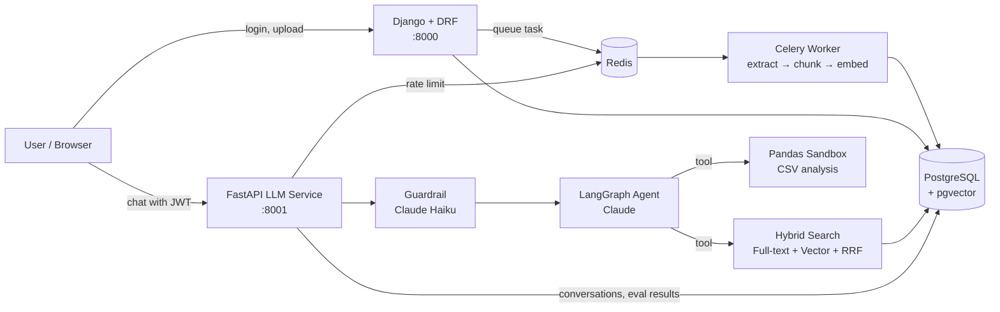

# Enterprise AI Knowledge Assistant (Agentic RAG)

An internal knowledge assistant for companies. Employees upload documents, then ask questions in a chat and get answers **grounded in those documents, with source citations**. Each user only sees answers drawn from documents their role and department are allowed to access.

**Tech stack:** Django · Django REST Framework · FastAPI · LangGraph · Claude · PostgreSQL + pgvector · Celery · Redis · Ragas · LLM Guardrails

---

## Features

- **Agentic RAG:** a LangGraph agent on Claude decides which tool to use to answer a question.
  - `retrieve_documents` runs hybrid search over the company documents.
  - `query_csv_dataset` analyses uploaded CSV files with pandas.
- **Hybrid search:** combines PostgreSQL full-text (keyword) search and pgvector (semantic) search, merged with Reciprocal Rank Fusion (RRF).
- **Document pipeline:** Celery processes uploads (PDF, DOCX, TXT, CSV) in the background. It extracts the text, splits it into 500-token chunks with 50-token overlap, and creates embeddings with `BAAI/bge-small-en-v1.5`.
- **Access control:** search is filtered by role and department *before* anything reaches the LLM.
- **Safe code execution:** pandas expressions written by the LLM are checked against an AST allow-list, with a timeout, before they run.
- **Guardrails:** Claude Haiku checks each query for prompt injection, jailbreaks and harmful requests.
- **Rate limiting:** Redis-based, per user (for example, 30 chat requests per minute).
- **Authentication:** JWT access and refresh tokens with rotation and blacklisting, plus Argon2 password hashing. Browser and API logins are supported.
- **Evaluation:**
  - Search quality: Hit@K, MRR and Precision@K against a test question set.
  - Answer quality: Ragas faithfulness and relevance scores, with an LLM as the judge.

---

## Architecture



**Request flow (chat):**
1. FastAPI validates the JWT that Django issued and applies the rate limit.
2. The guardrail checks the query.
3. The agent searches only the chunks the user is allowed to see.
4. Claude streams back an answer with `[1]`, `[2]` citations.
5. The conversation is saved to the database.

---

## Project Structure

```
enterprise-ai/
├── apps/
│   ├── accounts/      # users, roles, JWT login (browser + API)
│   ├── documents/     # upload, text extraction, chunking, embeddings (Celery)
│   ├── search/        # hybrid search + retrieval evaluation command
│   ├── chat/          # chat page
│   └── evaluation/    # evaluation API
├── config/            # Django settings, URLs, Celery config
├── llm_service/       # FastAPI AI service
│   ├── main.py        # API endpoints (chat streaming, evaluation)
│   ├── agents.py      # LangGraph agent + tools
│   ├── guardrails.py  # input safety check
│   ├── sandbox.py     # safe pandas execution
│   ├── rate_limit.py  # Redis rate limiter
│   ├── evaluation.py  # Ragas evaluation
│   └── migrations/    # Alembic migrations
├── templates/         # HTML pages
└── docker-compose.yml # PostgreSQL (pgvector) + Redis
```

---

## Getting Started

### Prerequisites
- Python 3.13
- Docker (for PostgreSQL and Redis)
- An [Anthropic API key](https://console.anthropic.com/)

### 1. Clone and install

```bash
git clone https://github.com/greeshmacode-wq/enterprise-ai.git
cd enterprise-ai
python -m venv venv
venv\Scripts\activate          # Windows
# source venv/bin/activate     # macOS / Linux
pip install -r requirements.txt
pip install -r llm_service/requirements.txt
```

### 2. Create a `.env` file in the project root

```env
SECRET_KEY=your-django-secret-key
DEBUG=True
ALLOWED_HOSTS=localhost,127.0.0.1

DB_NAME=enterprise_ai
DB_USER=postgres
DB_PASSWORD=your-db-password
DB_HOST=localhost
DB_PORT=5433

CELERY_BROKER_URL=redis://localhost:6380/0
CELERY_RESULT_BACKEND=redis://localhost:6380/0

LLM_SERVICE_URL=http://localhost:8001
ANTHROPIC_API_KEY=your-anthropic-api-key
```

### 3. Start PostgreSQL and Redis

```bash
docker volume create enterprise-ai-pgdata
docker compose up -d
```

### 4. Run the database migrations

```bash
python manage.py migrate
cd llm_service && alembic upgrade head && cd ..
python manage.py createsuperuser
```

### 5. Start the services (one terminal each)

```bash
# Django (web app + APIs)
python manage.py runserver 8000

# Celery worker (document processing)
celery -A config worker -l info --pool=solo     # --pool=solo is needed on Windows

# FastAPI (AI service)
uvicorn llm_service.main:app --port 8001 --reload
```

Open **http://localhost:8000**, log in, upload documents, then go to **Chat**.

---

## Evaluation

```bash
# Search quality: Hit@K, MRR, Precision@K
python manage.py evaluate_retrieval
python manage.py evaluate_retrieval --k 10 --verbose
```

Answer quality (Ragas) runs through the FastAPI evaluation endpoint, and the results are saved to the database.

---

## Main Endpoints

| Service | Method | Endpoint | Purpose |
|---|---|---|---|
| Django | POST | `/api/login/` | Get JWT access + refresh tokens |
| Django | POST | `/api/logout/` | Blacklist the refresh token |
| Django | POST | `/api/token/refresh/` | Refresh the access token |
| Django | POST | `/api/documents/upload/` | Upload a document |
| Django | GET | `/api/search/` | Hybrid search |
| FastAPI | POST | `/chat/stream` | Streaming chat answer |
| FastAPI | GET | `/health` | Health check |

---

## Future Improvements

- Re-ranking model on top of hybrid search
- Output guardrails (checking answers, not just questions)
- Caching for frequent queries
- Full Docker setup for all services
